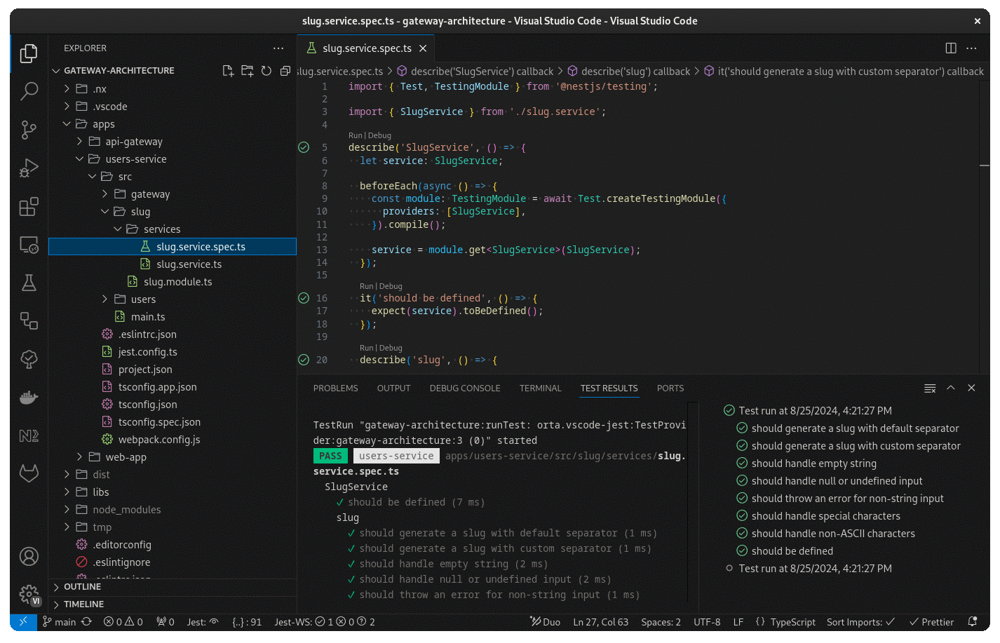

 
  <a href="Visual Studio Code.code-profile" download>
    Download
  </a>

---

Here is the list of extensions:

- [Auto Close Tag](https://marketplace.visualstudio.com/items?itemName=formulahendry.auto-close-tag)
- [Auto Import](https://marketplace.visualstudio.com/items?itemName=steoates.autoimport)
- [Auto Rename Tag](https://marketplace.visualstudio.com/items?itemName=formulahendry.auto-rename-tag)
- [CSS Modules](https://marketplace.visualstudio.com/items?itemName=clinyong.vscode-css-modules)
- [Docs Yaml](https://marketplace.visualstudio.com/items?itemName=docsmsft.docs-yaml)
- [Dotenv](<https://marketplace.visualstudio.com/items?itemName=mikestead.dotenv>)
- [Docker](https://marketplace.visualstudio.com/items?itemName=ms-azuretools.vscode-docker)
- [ESLint](https://marketplace.visualstudio.com/items?itemName=dbaeumer.vscode-eslint)
- [GitHub Actions](https://marketplace.visualstudio.com/items?itemName=github.vscode-github-actions)
- [Jest](https://marketplace.visualstudio.com/items?itemName=orta.vscode-jest)
- [Jest Runner](https://marketplace.visualstudio.com/items?itemName=firsttris.vscode-jest-runner)
- [Markdown All in One](https://marketplace.visualstudio.com/items?itemName=yzhang.markdown-all-in-one)
- [Markdown Mermaid](https://marketplace.visualstudio.com/items?itemName=bierner.markdown-mermaid)
- [Mermaid Markdown Syntax Highlighting](https://marketplace.visualstudio.com/items?itemName=bpruitt-goddard.mermaid-markdown-syntax-highlighting)
- [NPM Intellisense](https://marketplace.visualstudio.com/items?itemName=christian-kohler.npm-intellisense)
- [NPM Outdated](https://marketplace.visualstudio.com/items?itemName=mskelton.npm-outdated)
- [NPM Scripts](https://marketplace.visualstudio.com/items?itemName=rrehak.vscode-npm-scripts)
- [Remote Explorer](<https://marketplace.visualstudio.com/items?itemName=ms-vscode.remote-explorer>)
- [Remote SSH](https://marketplace.visualstudio.com/items?itemName=ms-vscode-remote.remote-ssh)
- [Remote SSH Edit](https://marketplace.visualstudio.com/items?itemName=ms-vscode-remote.remote-ssh-edit)
- [Remote Server](https://marketplace.visualstudio.com/items?itemName=ms-vscode-remote.remote-server)
- [Sort Imports](https://marketplace.visualstudio.com/items?itemName=amatiasq.sort-imports)
- [Todo Highlight](https://marketplace.visualstudio.com/items?itemName=wayou.vscode-todo-highlight)
- [Unfancy File Icons](https://marketplace.visualstudio.com/items?itemName=alexesprit.vscode-unfancy-file-icons)
- [YAML](https://marketplace.visualstudio.com/items?itemName=redhat.vscode-yaml)